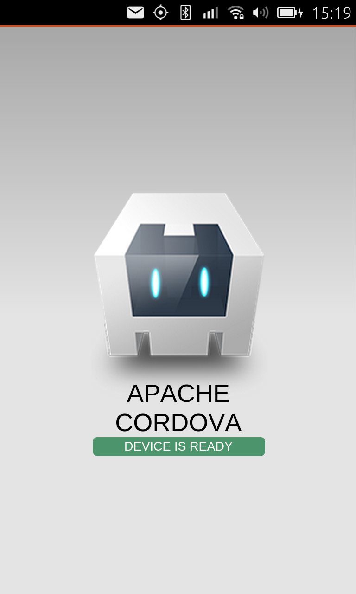

# Creating Ubuntu applications with Cordova

This is a high-level guide to Cordova on Ubuntu. The guide contains
information both for creating a new Cordova application for Ubuntu, or for
adding Ubuntu as a distribution platform for an existing Cordova application.

 

## What is Cordova?

Cordova is an Apache project that provides an HTML5 app build framework that
supports multiple distribution platforms, including Android, iOS, and now,
Ubuntu. Cordova also provides a plugin framework that exposes system and
device level functionality to HTML5 apps through plugins and JavaScript APIs
for these platforms. These APIs are available for popular mobile operating
systems, like Android, iOS, and Ubuntu as well.

Let’s first take a quick look at using upstream Cordova with its built-in
Ubuntu support and explain how existing Cordova app developers can add Ubuntu
as a build platform. Then we can take a look at using Cordova APIs to build
Ubuntu HTML5 apps.

## If you already develop Cordova apps

Starting with upstream Cordova 3.3, existing Cordova app developers can use
the usual Cordova CLI commands they already know. This includes adding Ubuntu
as a platform and building their project to create a click package that can be
used in Ubuntu.

Building a Cordova app for Ubuntu requires an Ubuntu system, much like
building for iOS requires an Apple system. We recommend the latest LTS
version, which is Ubuntu 16.04 LTS at the time of this writing. You need to
install the Cordova toolset on this build system, as described in the section
below: Configuring your environment.

Once you are ready building apps on Ubuntu, recompiling your Cordova app is as
simple as simple as this:

Add Ubuntu as a platform:

    # run this command from your application directory
    $ cordova platform add ubuntu

Add a plugin, in this case Camera

    $ cordova plugin add cordova-plugin-camera

Build the app to for devices:

    $ cordova build --device

That creates a click package suitable for use in Ubuntu.

**Note:** the cordova-ubuntu support code will generate a manifest.json file (and other standard click package bits) based on configuration elements found in the project config.xml.

Run the app on your attached device, in debug mode:

`$ cordova run --device --debug`

**Note:** you need cordova-cli 4.3.x to have all of these options available.\

**Important:** we do not recommend to use cordova-cli > 4.x yet, because of the tool API change that is not fully tested on Ubuntu. Check out upstream Cordova docs for detailed information about Ubuntu platform support in the native [Cordova CLI workflow](http://cordova.apache.org/docs/en/edge/guide_platforms_ubuntu_index.md.html#Ubuntu%20Platform%20Guide). 

Naturally, you need to write some JavaScript to use the APIs for the plugins
you have added too.

## Creating a Cordova app for Ubuntu

Ubuntu now supports the core Cordova APIs to let developers create native
Ubuntu applications that will use the Cordova runtime and can be recompiled
for other platforms as well.

So this section will be of interest for Ubuntu developers who want to
distribute their applications on multiple app stores, including the Ubuntu App
Store, but also the stores for iOS or Android apps.

Let’s take a moment to see what this means at a high level, then we can dive
into a few of the necessary details.

A few key points

  1. **The Cordova runtime** comprises a simple webview and a set plugins. This runtime will the load the actual application code and UI, made of Javascript, HTML and CSS files.
  2. **Cordova Plugins:** System and device access is provided by plugins. For example, there is a Camera plugin, an Accelerometer plugin, and more.
  3. **Each Cordova app provides the Cordova runtime:** Each app provides the cordova runtime that it uses. This gives developers perfect control over their app, by embedding all runtime dependencies inside their click packages.
  4. **Cross-compilation required.** Plugins are written in C++ and need to compiled for the target runtime architecture (armhf, x86, x86_64). So to create a fully functional application, the runtime must be compiled. This generally means cross-compiling armhf binaries from an x86 desktop system. This process is similar to the requirements for native C++ applications and uses the sams click chroot toolset.

### Configuring your environment

As noted above, you need an Ubuntu desktop system to build your application
for Ubuntu. We recommend Ubuntu 16.04 LTS as the base system to build your
application from. Your application can then execute on either your desktop, or
an attached Ubuntu phone or tablet device.

Install cordova from the Ubuntu Cordova PPA

    $ sudo apt-add-repository ppa:cordova-ubuntu/ppa; sudo apt-get update
    $ sudo apt-get install cordova-cli

Note for expert Cordova developers: you can also install cordova manually via
npm; but please stay with cordova-cli@4.3.x until the platformAPI switch is
fully tested on Ubuntu.

The build environment needs to be separated from the developer's environment,
to prevent unwanted side effects and provide a clean, repeatable process.

Create a click chroot for the armhf architecture:

    $ sudo apt-add-repository ppa:ubuntu-sdk-team/ppa
    $ sudo apt-get update
    # this will create a clean click chroot build environment
    $ sudo apt-get install click-dev phablet-tools ubuntu-sdk-api-15.04

Add build dependencies for Cordova apps inside the chroot:

    # add build dependencies inside the click chroot
    $ sudo click chroot -a armhf -f ubuntu-sdk-15.04 install cmake libicu-dev:armhf pkg-config qtbase5-dev:armhf qtchooser qtdeclarative5-dev:armhf qtfeedback5-dev:armhf qtlocation5-dev:armhf qtmultimedia5-dev:armhf qtpim5-dev:armhf libqt5sensors5-dev:armhf qtsystems5-dev:armhf

_**Note**: the ubuntu-sdk-15.04 framework is the recommended base framework to
use for cordova apps. If you wish to move to future revisions of the base
framework, you will need to provide an extra option in the build step below._

Verify your environment by running the sample app.

    $ cordova create myapp myapp.myid "My App"
    $ cd myapp
    $ cordova platform add ubuntu
    $ vi config.xml

Note: be sure to have a default application icon in `www/img/logo.png`

Note: also, update the author email field with a valid one:

        <author email="myid@ubuntu.com" />

Then, you should build the application for the target device:

    $ cordova build --device

**Note**: On first run, you may have to install some build dependencies in the click chroot. Check the section above for details

And then just start the application on the phone:

    $ cordova run --device --debug

At this point, you should see the familiar Cordova logo in the application
running on your phone.

Your Ubuntu system is ready for Cordova development.

Now, let’s take a high-level look at using the Cordova APIs.

## So many APIs! Which to use?

There is overlap in APIs from various sources for use in HTML5 apps. Consider
geolocation. Many web engines now support a geolocation API. W3C has a
proposed geolocation API as well. Cordova also provides a geolocation API.

Here we provide some guidelines for developers to align with Ubuntu
directions:

**First Choice:** Ubuntu App Platform APIs: When an Ubuntu App Platform API is available and not deprecated, it is the best choice. This provides the best integration with the platform. However, it will affect your ability to port to other platforms, if that is your goal. For example, developers should use Content Hub, Online Accounts and Alarms APIs even if other APIs may exist that provide similar functionality.

**Second Choice:** W3C: Working W3C standard APIs should be used when there is no Ubuntu App Platform API for the functionality. W3C APIs are quickly and well supported in browsers and web containers and are likely to provide the most stability and standard APIs, so these are the best choice when platform APIs do not exist.

**Rocking with Cordova APIs:** Cordova APIs provide key functionality not yet present in W3C standards or the Ubuntu Platform. Examples include Splash Screen and Accelerometer. As such Cordova APIs are a great choice for these system and device level features that can really make your HTML5 app rock!

Ubuntu HTML5, Cordova and Web APIs are in constant development, so the
recommendations for the particular APIs mentioned above may be updated. Please
stay tuned.

## Programming with Cordova

Here we look at how your app knows that Cordova is loaded and ready. This is
where you can place code that should only run once Cordova has fully detected
your device, for example event handlers that use Cordova navigator objects.

### Handling Cordova’s deviceready event

Web developers are familiar with the window.onload event that signals when the
DOM is fully loaded. This event is useful is for running event handler code
right after the DOM is loaded.

In Ubuntu HTML5 apps, we use that event to run the code that initializes the
Ubuntu UI framework. After that initialization code, your Cordova app can set
up an event handler for Cordova’s deviceready event. This event signals that
the Cordova runtime is fully ready for operations. For example, this is where
you should place your event handlers that invoke Cordova objects.

Let’s take a look at sample code that has these parts:

    window.onload = function () {
    /* Optional: Initialize the Ubuntu UI framework */
       var UI = new UbuntuUI();
       UI.init();
    /* Handle the Cordova deviceready event */
       document.addEventListener("deviceready", function() {
           if (console && console.log)
               console.log('Platform layer API ready');
    /* Add event listeners that invoke Cordova here */
           // take picture with Cordova navigator.camera object
           UI.button("click").click( function() {
               navigator.camera.getPicture(onSuccess, onFail, {
                   destinationType: Camera.DestinationType.DATA_URL
                });
              console.log("Take Picture button clicked");
           }); // "click" button event handler
       }, false);
    };
    function onSuccess(data){ DO SOMETHING };
    function onFail(data){ DO SOMETHING };

Here, inside the deviceready event handler, we add an event handler for an
Ubuntu button that callsnavigator.camera.getPicture(…). That’s a standard and
straightforward pattern for a lot of what you can do with Cordova APIs.

## Next steps

Check out the [Cordova CameraTutorial](../tutorials/cordova-camera-app-tutorial.md), which
provides all the steps you need to make a working HTML5 Camera app that let’s
you snap a picture and then displays it in the app.

You may also want to check out the [HTML5Guide](html5-guide.md) for an overview of Ubuntu
HTML5.

