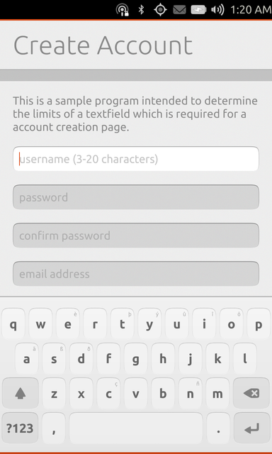
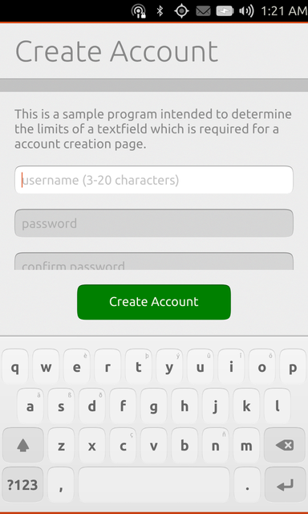
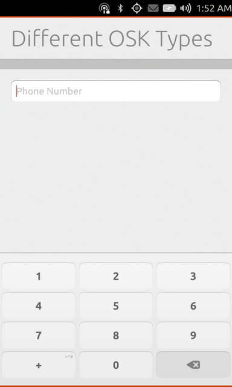
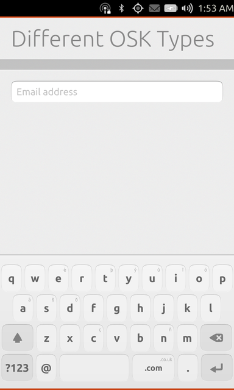

# Tutorials - Ubuntu screen keyboard tricks

_Originally posted by Nekhelesh Ramananthan [on his blog](https://web.archive.org/web/20160713053154/http://nik90.com/ubuntu-touch-keyboard-tricks/)_

While working on [Ubuntu Clock App](https://launchpad.net/ubuntu-clock-app)
and [Flashback](https://launchpad.net/cliffhanger) I used to always run into
small issues like the input fields being hidden by the **on-screen keyboard
(OSK)** on the phone. Back in April 2013 (for starters I cannot believe it has
been 8 months already!) I did not have an Ubuntu Phone and hence it was rather
difficult to identify these issues on time resulting in commits still being
pushed to trunk. With time, I have learnt to address them and hence I thought
I share some of those tricks along with some new ones so that you don't have
to start from scratch like me or some of the core apps developers.

### Preventing UI from being overlapped by OSK

If you look at most applications run on the phone, their UI elements are often
given sufficient padding to ensure they are aesthetically pleasing and provide
breathing space for the elements. As a result, when the OSK appears it results
in about 40% of the screen covered and hiding many application UI elements.
This could result in the user searching for vital application elements like
buttons and having a rather touch time.

Hence while using input fields like `TextField`, `TextArea` it is important to
ensure that critical UI elements which need to be visible to the user at all
times are not hidden by the OSK. An important thing to keep in mind that you
don't really face this issue while testing your application on the desktop. So
do make it a point to ensure that you test your commit on a phone or an
emulator before committing to trunk.

One way of doing this in QML is by using a Flickable which automatically
allows the user to scroll the interface to find the appropriate content.
However this is still cumbersome to make the user scroll in the remaining 60%
screen height available to get to the content he/she is looking for. A more
clever approach is to anchor those critical UI elements like a button, label
to the OSK. The Ubuntu SDK offers a rather clean approach to doing this.

In your main QML file, inside the MainView{} element you can set a property
true as shown below,

`anchorToKeyboard: true`

This allows any content or UI element that you anchor to the bottom of the
application to automatically appear above the OSK. Let's look at an example.
We are going to make an account creation page together. It is going to consist
of a username, password and email input field. Finally there will be a button
to perform the account creation action.

Pay close attention to the anchors of the `flickable` and the
`createButton`!

``` QML
Page {
    id: accountPage
    Flickable {
        id: sampleFlickable
        clip: true
        contentHeight: mainColumn.height + units.gu(5)
        anchors {
            top: parent.top
            left: parent.left
            right: parent.right
            bottom: createButton.top
            bottomMargin: units.gu(2)
        }            
        Column {
            id: mainColumn
            spacing: units.gu(2)
            anchors {
                top: parent.top
                left: parent.left
                right: parent.right
                margins: units.gu(2)
            }
            TextField {
                id: username
                width: parent.width
                placeholderText: "username"
            }
            TextField {
                id: password
                width: parent.width
                placeholderText: "password"
            }
            TextField {
                id: email
                width: parent.width
                placeholderText: "email"
            }
        }
    }
    Button {
        id: createButton
        text: "Create Account"
        anchors {
            horizontalCenter: parent.horizontalCenter
            bottom: parent.bottom
            margins: units.gu(2)
        }
        onClicked: // perform log in function
    }
}
```

When you use this login page without setting the `anchorToKeyboard` property
to true, it will result in the create account button being hidden as shown in
the screenshot below.



However by setting the `anchorToKeyboard` property to true, you will get a
better results as shown. Isn't that much better? By using a flickable, a user
will be able to scroll the UI to see other text fields, but the create account
button is always visible



The example above is just one use case of many. Another example that comes to
my mind is having a search page with a search box below which a list view is
shown. Ideally you want to anchor the list view to the bottom of the page. So
when the OSK appears, the list view gets anchored to the OSK providing a much
better view.

### Special Keyboards for specific purposes

Another minor detail that I think improves the user experience is showing the
right keyboard. Here is a quote that I have read in several websites about
good application design,

> A good UI is one which guides and self corrects the user to perform the
right action rather than one which shows a notification prompt informing the
user that he has made a mistake.

Though I am no designer, when I think about it from the user's perspective I
agree to it completely. Who likes to see annoying pop-ups (from the windows XP
times) like,


So when it comes to receiving input from the user, one step towards guiding
the user is by showing the correct on-screen keyboard. Let me illustrate :-)

Let's say you want to get the user's phone number (commonly seen in messaging
apps), it is better to show a keyboard allowing only numeric inputs,

``` QML
TextField {
    id: username
    width: parent.width
    placeholderText: "phone number"
    inputMethodHints: Qt.ImhDialableCharactersOnly
}
```



Let's say you want to get the user's email address, it is better to show a
keyboard with common characters such as `@` and `.com`.

``` QML
TextField {
    id: username
    width: parent.width
    placeholderText: "phone number"
    inputMethodHints: Qt.ImhEmailCharactersOnly
}
```



As you may have noticed from the above code examples, you can control the OSK
type shown using the `inputMethodHints` method. The Ubuntu SDK is quite
powerful (by inheriting and improving on upstream QML widgets). If you would
like to get more information about the different textfield method hints, I
will refer you to the official documentation found [here](https://developer.ubuntu.com/api/apps/qml/sdk-14.10/Ubuntu.Components.TextField/).

Good Luck with your app! Remember one achieves a great user experience by
paying attention to such small details.

**Update 1:** Just out of curiosity, if you are interested in doing some special actions when the OSK appears and disappears you can do that using the connections elements as shown below:

``` QML
Connections {
    target: Qt.inputMethod
    onVisibleChanged: console.log("OSK visible: " + visible)
}
```

Whenever the OSK appears, it will fire the onVisibleChanged signal.

**Update 2:** One other inputMethodHints that I failed to mention is `Qt.ImhNoAutoUppercase`. By default the OSK capitalises the first letter of a sentence. This is sometimes deterrent to input fields like username. By setting this method hint, you can disable that feature.

**Update 3:** I just learned from Jamie Strandboge that the OSK can be hidden using `Qt.inputMethod.hide()`.
