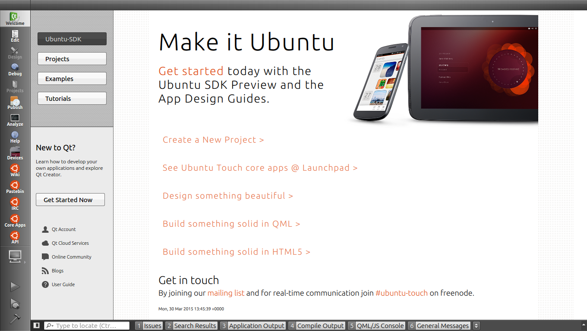

# Welcome to the Ubuntu SDK

The Ubuntu SDK is your full-featured integrated development environment (IDE)
for writing Ubuntu apps.

Based on QtCreator, the Ubuntu SDK provides all the tools you need to get up
and running and super productive developing Ubuntu apps of all types, with
QML, HTML5 and C++ supported now and other possibilities on the radar, so stay
tuned!

## Ubuntu SDK highlights

  * All the **technical brilliance and capabilities of the QtCreator** platform with additional Ubuntu-specific features layered on top
  * **New Project Wizard** simplifies creating new app and scope projects
  * **Bazaar** (and other) version control system built-in
  * **Beautiful GUI** with wide range of advanced code editing features and preferences
  * **Run app projects from the SDK** on the development system, on attached devices, and on Ubuntu emulators
  * **Manage attached physical devices** and create and manage **Ubuntu emulator** instances
  * **Package the app project** as a click package for easy 
  * **Cross build** click packages using CMake to different architectures (like armhf)
  * **Install and run click packages** on devices and Ubuntu emulators
  * **Debug** support

## Next steps

  * Get started and easily [install the Ubuntu SDK](installing-the-sdk.md).
  * Enable [developer mode](https://developer.ubuntu.com/en/start/ubuntu-for-devices/installing-ubuntu-for-devices#enabling-dev-mode) on your Ubuntu device.
  * Learn how to create new projects, run apps from the SDK, use the emulator, how to cross build and more. [Check out the SDK tutorials](../../apps/sdk/tutorials/index.md).

