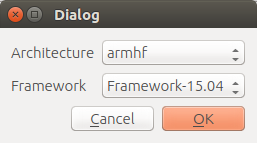
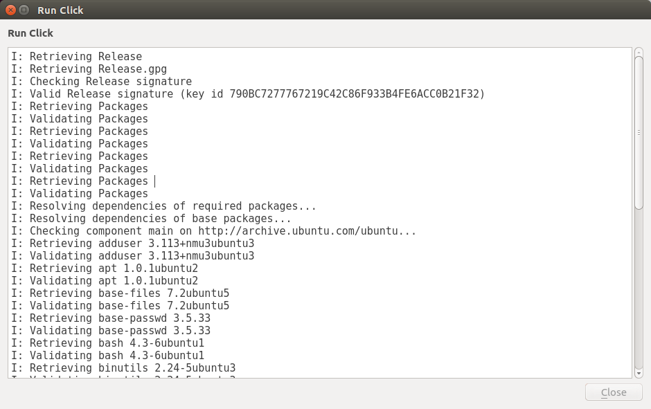
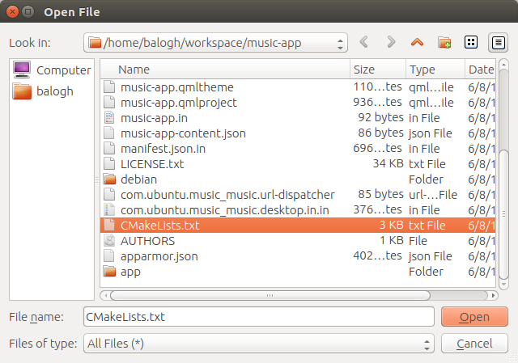
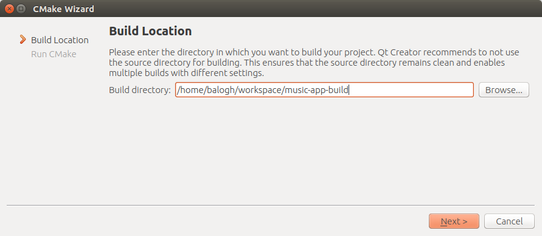
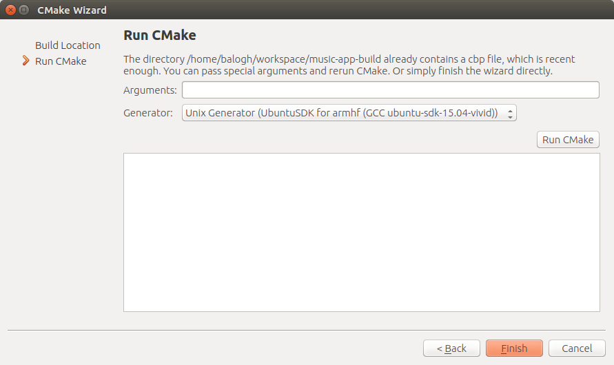
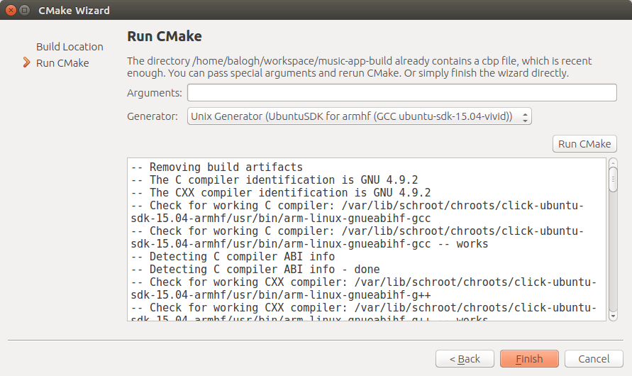

# Tutorials - building cross-architecture click applications


Building click packages is as easy as clicking a button. However building a
package that uses compiled code and needs to run on an armhf device requires a
little more setup. Unless you happen to have a development system that is also
armhf, you need an armhf environment for building the package. The Ubuntu SDK
can create a click build target that allows you to target the build for an
armhf device. This guide enables help you to:

  * Create an armhf click build target
  * Configure a project to build using the new build target
  * Build the project and verify the generated click package contains compiled armhf executables

## Creating an armhf click build target

To create a click build target in Ubuntu SDK, do the following:

  * Open **Tools** > **Options.**
  * Select **Ubuntu** in the vertical panel on the left of the **Options** dialog.
  * Select the **Click** tab.

The list displays current click build targets, including the targeted
framework and architecture


  * Click **Create Click Target** to create a new target.
  * In the popup dialog, select your target framework and armhf as the architecture.



  * Click **OK** and enter your password as prompted.

**Note**: Creating the click build target requires internet access and time. During this step, an armhf chroot is created for building armhf native code



  * After the click build target is finished, close Ubuntu SDK.

**Note**: this step is required to ensure the new target is autodetected for use in a project.

## Maintaining a click build target

If you require additional build dependencies beyond what the SDK provides,
they need to be installed in your click build target manually. If the SDK
provides everything needed to build your project, you may safely skip this
section. To maintain a click build target:

  * Open **Tools** > **Options.**
  * Select **Ubuntu** in the vertical panel on the left of the **Options** dialog.
  * Select the **Click** tab.


The list displays current click build targets, including the targeted
framework and architecture

  * Click **Maintain** for the click build target you wish to modify
  * A terminal appears, granting root access to the chroot. This provides command line access to the chroot. You can install new packages via apt or another method just like a normal ubuntu installation. Be careful to only install what you need. Any modifications you make affects all builds using this target.

## Configuring a project to use an armhf click build target

To configure your project to use the armhf click build target: If you've never
opened the project in Ubuntu SDK before:

 * Open the project you wish to build (here I open the lp:music-app).​

​ 

 * Select the build location.​



 * Since it is a cmake project we need to select a generator and so a target
Kit



 * Push the "Run Cmake" button and wait for the results



 * The project is opened.


For an existing project:

  * Open the project you wish to build.
  * Open **Projects** tab on the left vertical pane.
  * From the **Add Kit** dropdown select the new armhf entry, "UbuntuSDK for armhf (GCC ubuntu-sdk-XX.XX-XXXXX)".
  * A new tab is created showing the kit name and allowing you to set options.
  * Click the new tab. This is all that is needed to configure the project to build using the selected the armhf kit. (This also closes the new tab.)

  


## Building with an armhf click build target

Once your click build target is created and configured for use within the
project, you can use it for building, as long as the project is configured
using cmake.

  * Open **Build and Run Kit Selector** which can be found in the vertical left pane, as well as **Build** > **Open Build and Run Kit Selector**.
    * Ensure the armhf click build target is selected. 
  * Open the **Publish** tab located in the vertical pane on the left.
  * Click **Create package**.
  * The created click package will be placed to the build directory of the project. The exact path to the click package is logged in the "Compilet output" logs in Edit mode. One might need to scroll up few pages. 

The Ubuntu SDK should utilize the target we created earlier to produce a build
for armhf devices. You can deploy your application to your tablet, phone or
other armhf device. If something goes wrong, check the compile output tab.

## Verifying the armhf click package

After a successful build or your project, a compiled click package is placed
inside your build directory. To verify the click package was built correctly:

  * Open a terminal and install the **click-reviewers-tools** if it is not already installed
  * Open the **Publish** tab located in the vertical pane on the left.
  * Click **Validate Click package**.
  * Navigate to the package you built, and open it.
  * Check the output for warnings and error messages


To verify the package has been compiled properly:

  * Open a terminal.
  * Execute the following commands replacing **myapp.click** with the click package filename: `click contents **myapp.click** | grep arm`
  * The contents of the click package display, showing your binary and compiled modules. For example,

```
drwxr-xr-x root/root         0 2014-05-08 21:09 ./lib/arm-linux-gnueabihf/
drwxr-xr-x root/root         0 2014-05-08 21:09 ./lib/arm-linux-gnueabihf/org/
drwxr-xr-x root/root         0 2014-05-08 21:09 ./lib/arm-linux-gnueabihf/org/nemomobile/
drwxr-xr-x root/root         0 2014-05-08 21:09 ./lib/arm-linux-gnueabihf/org/nemomobile/folderlistmodel/
-rw-r--r-- root/root    505271 2014-05-08 21:09 ./lib/arm-linux-gnueabihf/org/nemomobile/folderlistmodel/libnemofolderlistmodel.so
-rw-r--r-- root/root        65 2014-05-08 21:02 ./lib/arm-linux-gnueabihf/org/nemomobile/folderlistmodel/qmldir
drwxr-xr-x root/root         0 2014-05-08 21:09 ./lib/arm-linux-gnueabihf/bin/
-rwxr-xr-x root/root     39900 2014-05-08 21:09 ./lib/arm-linux-gnueabihf/bin/filemanager
```

  * Execute the following commands replacing **myapp.click** with the click package filename and **path/to/your/binary** with the path to the binary file inside the click package. You can find this path in the printout from the previous step.

```
dpkg -x **myapp.click** unpacked
file unpacked**/path/to/your/binary**
```

  * The file command shows the executable is **ARM**. For example,
    `/tmp/unpacked/lib/arm-linux-gnueabihf/bin/filemanager`: ELF 32-bit LSB  executable, ARM, ...

## Getting further help

This guide provides help on building a project with an armhf click build
target. This enables you to build projects containing native code on armhf
devices. If you need further help, [justask](http://www.askubuntu.com/questions/ask?tags=application-development)!
