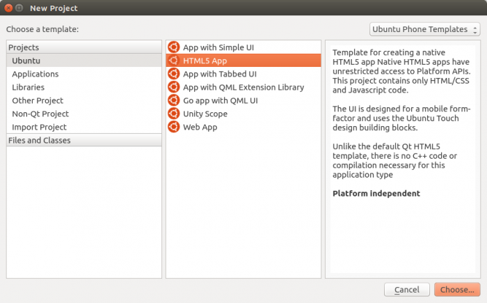
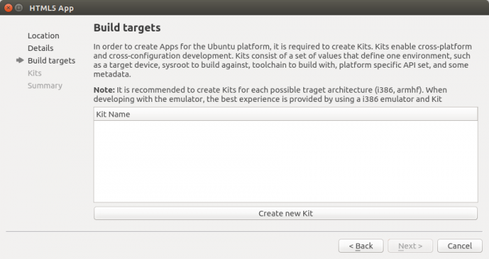
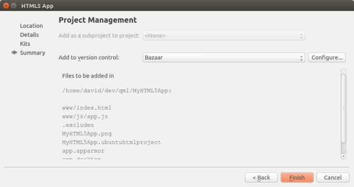
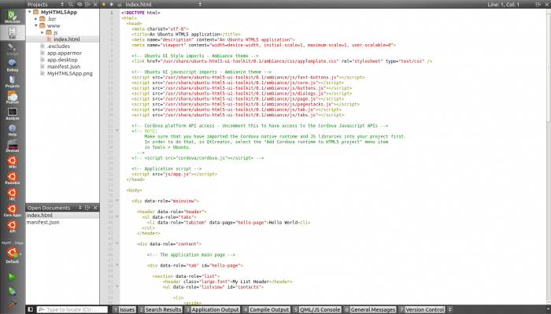
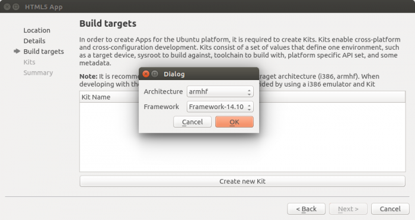

Once you have the Ubuntu SDK [installed and setup](../../../platform/sdk/installing-the-sdk.md), you can very easily start
writing an app. Read below how to do this in seven steps.

There are many different types of app projects you can create in the SDK.
Ubuntu specific app projects are all listed under the **Ubuntu** project type
in the new project wizard.

Here, we create an Ubuntu HTML5 App project as an example. The same process is
used for other types.

  1. Launch the wizard in the Ubuntu SDK with: **File** > **New File or Project**
  2. Select the **Ubuntu** project type, then **HTML5 App,** and then click the **Choose** button, as shown here:  

  3. Give your project a **Name**, specify a directory to create it in, and click the **Next** button, as shown here:  

**Tip**: You may want to enable this as the default directory for all Ubuntu SDK projects by checking the **Use as default project location** check box.

  4. On the **Click package parameters** page, please enter:
  * Your developer **nickname** also known as "package namespace", this has to match the one you are using to publish in [MyApps](https://myapps.developer.ubuntu.com/dev/click-apps/). It will be appended to your package name in order to ensure that packages of the same name uploaded by two developers will remain unique. If you have a [Launchpad](https://launchpad.net/) username, you should use that.
  * Your **maintainer** information: your name and email, ie: Joe Blobbs <joe@blobbs.com>
  * The **name** of your app.

  5. On the **Build targets ** page. You will be asked to create at least one device kit for your project.

Device kits are devices environments required to build and run your app. The
**Create new kit** button will guide you through this simple process, but you
can have a look at the [device kitsarticle](click-targets-and-device-kits.md) to learn
more about them.

After creating a device kit, select it to continue:

  6. On the **Project Management** page, optionally select **Bazaar** under **Add to version control**:  

**Tip**: You can also manage your project under revision control from the command line using bzr. To use Bazaar in the shell, first open a terminal with Ctrl + Alt + T, then install the bzr package and view help as follows:
    sudo apt-get install bzr
    bzr help

  7. Click **Finish**, and the wizard finishes, the project is created, and you are returned to the main SDK GUI. At this point your new project looks something like this:

**Tip**: Each app project has a desktop file that represents the app in Unity, including its displayed name and its icon.

## Next steps

Without making any changes to your app, you can run it. Check out the
**[Running Apps from the SDK](running-apps-from-the-sdk.md)** tutorial in the Ubuntu SDK section for useful steps and
information.

