This is a high level introduction to Ubuntu scopes, a great starting place for
understanding scopes and getting started developing scopes. For other useful
resources, including API reference docs, a hands-on tutorial, and an in-depth
developer’s guide, see the “Next steps” section at the end of this guide.

## The Ubuntu dash and scopes architecture

One of **Unity**‘s main features is the **Dash**. The Dash allows the user to
quickly search for information both locally (installed applications, recent
files, bookmarks, etc) and remotely (Twitter, Google Drive, etc).

The Dash achieves this by having one or more **Scopes** that are responsible
for providing one category of search results. The user may search for content
either through the Scopes scope in the Dash or through the Scope’s own page.

### Finding and launching scopes

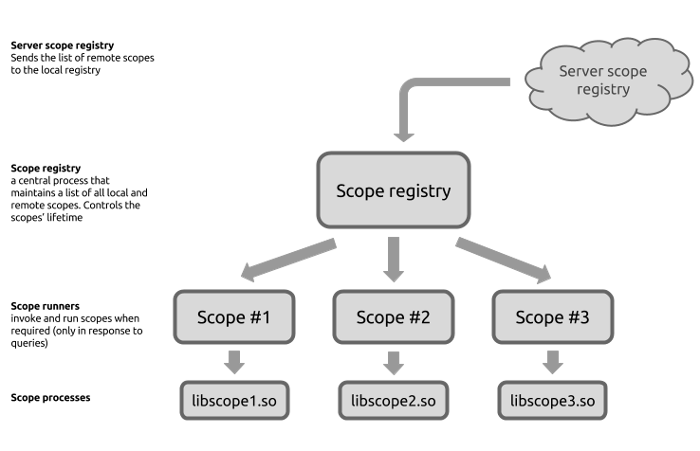

Scopes can be local or remote. Local scopes run on the device and remote
scopes run on the Scopes Server. For Ubuntu 14.10 only local scope submission
is supported, but remote scope creation and submission will be added in
subsequent releases.

The central part of the scopes’s lifecycle is the local scope registry, which
is a process that maintains a list of all local and remote scopes (the list of
remote scopes is sent to the local registry from the Scopes Server at
request). Once that list is available, all scopes are equal to the client.

The scope registry starts scopes on demand and runs them only when required,
so that only the required scopes will be run as a result of a query.

### Scopes data flow

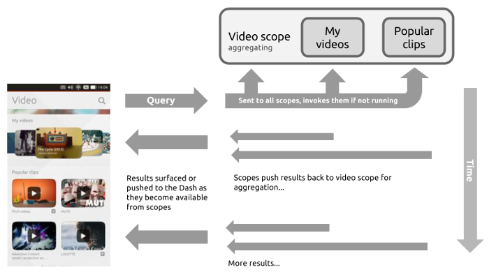

### Scopes terminology

  * **Scope**  
The search engine itself, talking to a web service or a local database. Its
visible representation is a Dash page.

  * **Standalone scope**  
A scope that presents a single set of results and queries one single source

  * **Aggregating scope**  
A scope that acts as a container for multiple standalone scopes. Every scope
can be an aggregating scope, which enable richer content on their Dash pages

  * **Dash page**  
The visible part of the scope: dash pages present the scope’s search interface
and its results. Dash pages can be marked as favourites, so that they are
always pinned in the Dash.

#### Got a question? Ask!

If you’ve got any question about Ubuntu on mobile devices or developing apps
for the phone, our experts are here to help. Ask Ubuntu is a free, community-
driven Q&A site for Ubuntu users and developers.

[Ask a question now›](http://www.askubuntu.com/questions/ask?tags=mobile,application-development)

## What are scopes?

Scopes deliver content derived from almost any source straight into the Ubuntu
shell. A user enters a search term in a scope, the scope generates content,
and the content displays, as it comes in. The user then selects an interesting
search result, and its preview displays, usually with even more data. The user
touches or clicks the preview, and the song or video plays, the related page
displays in the browser, or an app opens and does something appropriate.

Scopes deliver content to the user outside of any app. Simple content like web
or database queries, or finely-grained, richly-organized content deriving from
multiple data sources lands directly in the user experience. Scopes are one of
the core features of Ubuntu. So let’s get started with an overview of key
scope features of interest to scope developers.

### Scope data aggregation

A scope is at heart a query. It provides results (content) to the client that
calls it (it also provides data for the result preview phase). For example, a
user may enter a search term in the Ubuntu shell, and the shell calls a scope.
The scope performs its query and surfaces results to the shell, where they are
rendered.

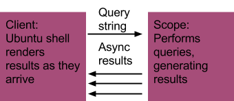

But, a scope does not know or care what calls it, which means a scope can call
a scope. A scope can aggregate data from any data sources, including other
scopes.

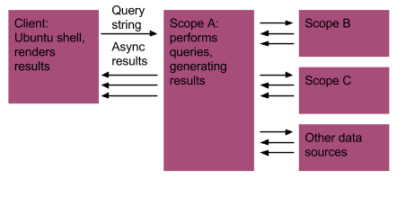

A scope is an atomic query process that returns results (and preview data) to
whatever calls it. This architecture enables many possibilities to enhance the
user experience with rich content aggregated from many sources and displayed
with style and beauty right in the Ubuntu shell.

Scopes can also provide content even when there is no initial query string,
enabling rich content display before there is any user interaction.

### Data <-> view separation

Scope content is returned as data that displays using default rendering. But,
the developer can also provide hints that control how content should be
rendered in the results view. The framework provides many rendering options
for this, and they are declared in a simple JSON object. The developer does
not need to interact with a GUI toolkit. So there is a nice data <-> view
separation here.

The same data<-> view approach is used with preview display. When the user
selects a piece of content and its preview displays, the client uses widgets
and layouts the developer provides for the preview. These widgets and layouts
are defined simply, and they are not GUI toolkit objects of any kind.

This strict data <-> view separation simplifies scope development.

### C++ Scope API, for starters

The Ubuntu scope framework is independent of any scope’s language of
implementation. Ubuntu now provides a scope API for C++. Stay tuned for news
of additional language support.

## Customizable results display

Scopes make queries and return content as a set of results. These results can
be displayed in many interesting ways with almost no coding needed (results do
need to be generated by the scope, of course). The developer simply writes a
query that provides the results, and the client displays them using the Unity
8 Dash toolkit.

Here is an example of results displayed with the default results renderer:

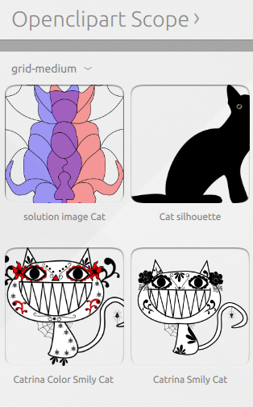

Developers can choose to enhance results display in various ways that add
style and navigation options to the user experience and make the data more
interesting. For example, each result may contain more data fields, such as a
subtitle, a mascot, and more.

A scope can also return search results sorted by category. Consider a “Nearby”
scope that takes an address and returns interesting things nearby. Restaurant
results might display the street address, while taxi company results might
show the phone number. And, different result categories are visually sorted in
the client without any work by the developer.

Here is an example of two categories of results displayed from the same scope,
one with carousel layout, one with grid layout:

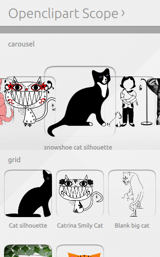

There are many other rendering options for result categories, including
additional layouts (like journal, vertical-journal, organic-grid, and more),
different result card sizes, different card background colors and gradients,
overlay text, and more. These rendering options are simply declared in the
renderer template (it is a small JSON object).

Here are a few grid layout samples:

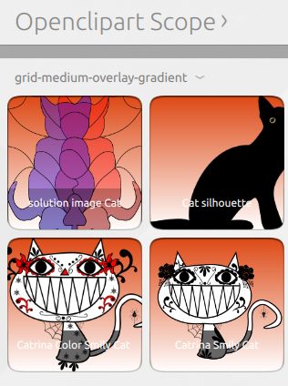

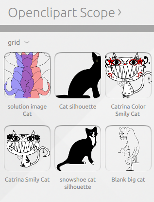

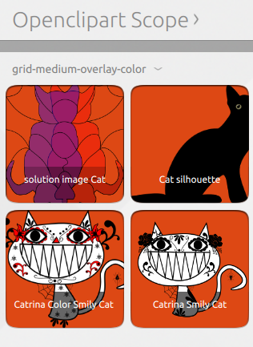

And here are a few simple variations with carousel layouts:

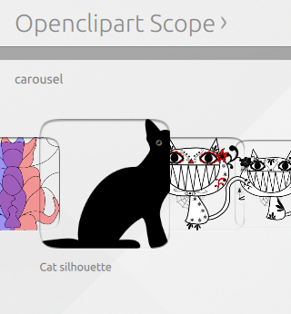

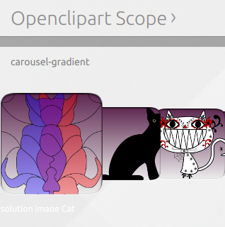

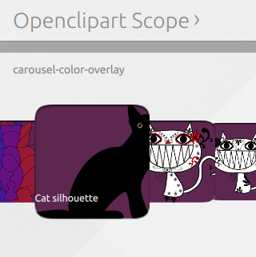

## Preview widgets

When the user wants more info, they select a result and its preview displays.
Scopes provide highly customizable previews. Previews may contain any amount
of arbitrary data. That data can be drawn from the search result being
previewed or may simply be added programmatically.

A preview is made by creating widgets, attaching data to the widget fields,
and indicating widget layout options for different situations. The widgets are
structured containers for content (not actual GUI toolkit objects). There are
a set of defined widget types, and each type has a set of fields for which the
developer provides values.

Here’s a sample preview. It contains four widgets, a header widget (which has
a title and a subtitle), an image widget (which has a source field), a text
widget, and an actions widget:

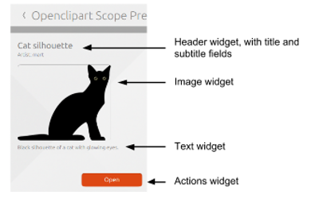

Here are the same four widgets, just in a different order:

You can add data to the preview that is not derived from the search result
being processed. For example, here a new “text” widget is added:

Different types of search results in the same scope can expose different data
in the preview. For example, a restaurant preview may expose ratings and
perhaps popular menu items, whereas tourist sites might provide a description,
a picture and a list of nearby train stations.

## Preview layouts

Scopes let developers provide different preview layouts that expose data more
effectively in different display contexts, for example portrait and display
modes. Like preview widgets, preview layouts use a data <-> view separation.

The idea is simple: define different layouts based on the number of columns
available. For each layout, assign the widgets to appropriate columns. Now,
let the client determine how many columns are available at any given instant
and use the appropriate layout.

Let’s take a look at how this might work in practice. A small device in
portrait mode probably needs at least a single-column layout with all widgets
added to it. But, to add landscape mode support, the developer can simply add
a two-column layout and assign the widgets to column one and column two as
appropriate. Additional widgets not present in the single-column layout can be
added to the two-column layout, thus providing more content when there is more
space.

Here is an example of a two column layout. Note that the image description is
at the top of column two, and there are two additional text widgets
(containing “Lorem ipsum …”):

# Next steps

  * A good starting point is looking at [Scopes development procedures](/en/phone/scopes/tutorials/scope-development-procedures/). This provides steps for creating a scope project in the Ubuntu SDK, building it and running it on the desktop and devices.
  * Next, you can check out the [scopes tutorials](/en/phone/scopes/tutorials/). They provide working examples and discuss key points from a coding and development perspective.
  * Since scopes can do so much more, you may want to have a look at the [In-Depth Scopes Developer Guide](https://developer.ubuntu.com/api/scopes/cpp/development/index/).
  * And of course, you need the scopes [API reference docs](/en/phone/scopes/api/).

