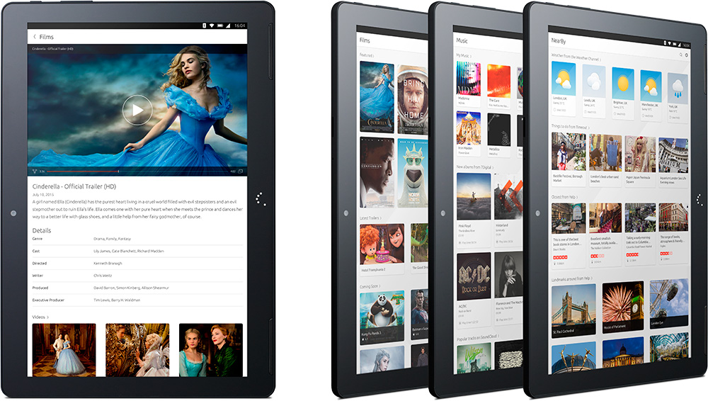

# Scopes

### Build more than just apps

Ubuntu enables the delivery of content and services directly to the screen –
effectively creating a rich, fast and unfragmented experience for users, while
giving developers the unprecedented opportunity to create app-like experiences
that are integral to the device, at a fraction of the cost to build and
maintain traditional apps.

These experiences are developed using Ubuntu Scopes, a new UI toolkit
available through the Ubuntu SDK.

## A new generation of mobile experiences

### Scopes in action

Missing flash plugin. Please download the latest Adobe Flash Player:

[Watch on YouTube](https://www.youtube.com/watch?v=CsDFMIphtZk)

Scopes are a complete reinvention of the content and services experience where
you can stop trying to bring the user "in", but simply focus on bringing the
content "out".

Users have a new way to access content and apps without having to download
individual apps – and developers have the opportunity to be discovered via the
device’s categorized home screens.

It’s a world away from traditional smartphones and the app icon grid, and
brings a great opportunity for developers and content producers to shine.

## How it works

  * Scopes are a point of entry into the Ubuntu ecosystem for all kinds of developers: the API is availaible in JavaScript, C++ and Go.

  * Using keywords, scopes can be aggregated into more general scopes, called Aggregation Scopes: your content is visible in context of what the user is actively looking for.

  * Scopes work with a simple client-server model, where a locally running server mediates data exchange between your content and user requests, keeping every scopes confined and independant from each other.

### There are two types of scopes:

### Aggregation Scopes

These define the device’s default experience by bringing together content and
services from multiple sources and delivering them as a unified experience.

For example, the **Videos scope** will display multiple video sources, and
similarly a **Music scope** can display music related content from a variety
of providers.

Examples: Music, Videos, News, Films, Photos.

### Branded Scopes

App-like experiences delivered directly to the screen. This is the fastest
path to develop a rich mobile experience on Ubuntu, with higher
discoverability and easier to develop and maintain than traditional apps.

By attributing categories (music, news, videos, etc) to your branded Scopes,
users can discover them from both the default aggregation Scopes and the
Store. They can become integral to the device’s default experience once a user
favorites your branded scope.

Examples: Youtube, Flickr, Amazon, Telegram, The Weather Channel, Open
Library.

* * *

### Get started

You're all set up to get started with your first scope, there are tutorials
available for JavaScript, Go and C++, that will help you write it.

[Start a scope tutorial](/phone/scopes/tutorials/)

### Learn more about scopes

When you want to dive further into scopes, you can always find wisdom in our
selection of scopes developer and design guides.

  * [Scopes developer guides ›](/phone/scopes/guides/)
  * [Scopes design guide ›](http://design.ubuntu.com/scopes)

### Need help?

Thanks to our active community, you can find support from a variety of sources
such as Ask Ubuntu, our mailing lists or IRC channel.

  * [Ask a scope question on Ask Ubuntu ›](http://askubuntu.com/questions/tagged/scopes)
  * [Reach out to other developers (mailing-list, live chat) ›](https://developer.ubuntu.com/en/community/)

