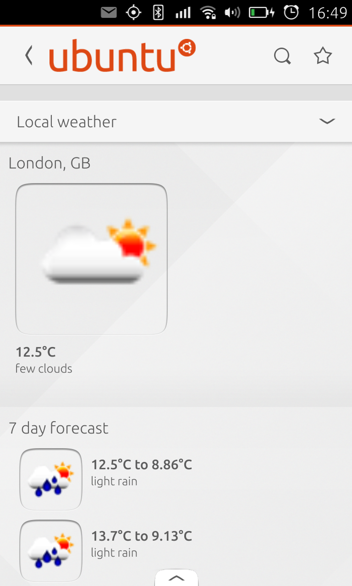
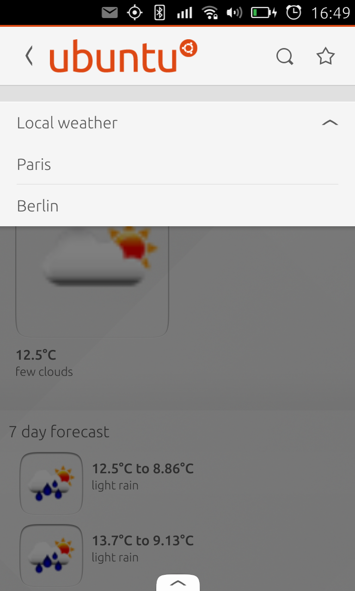
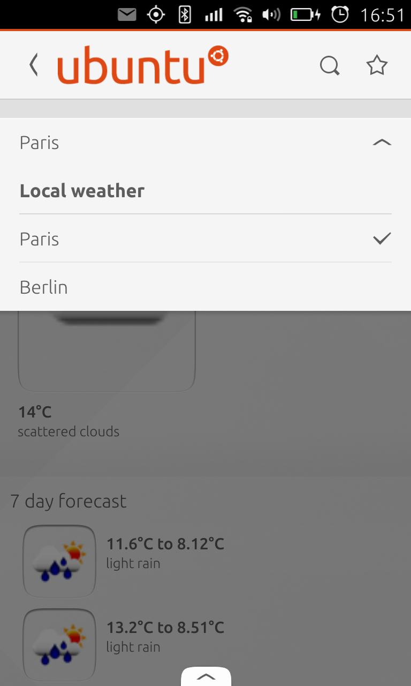
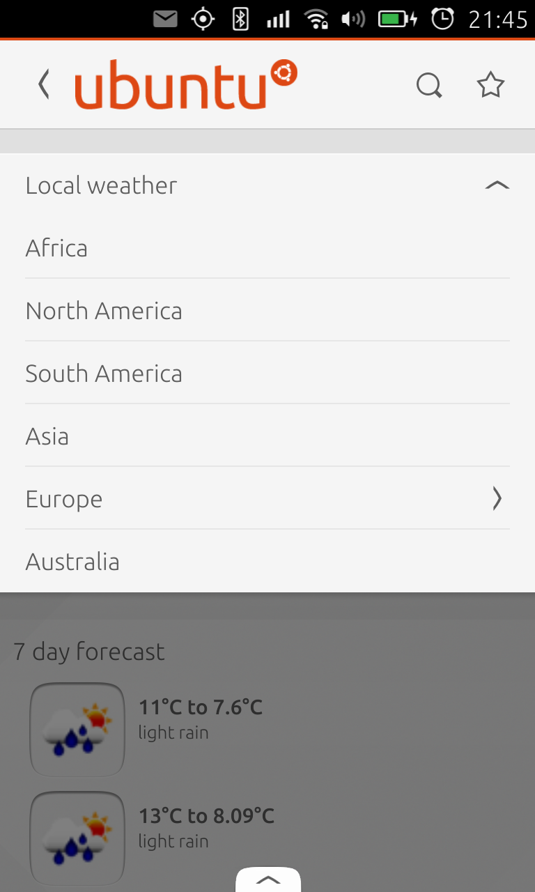
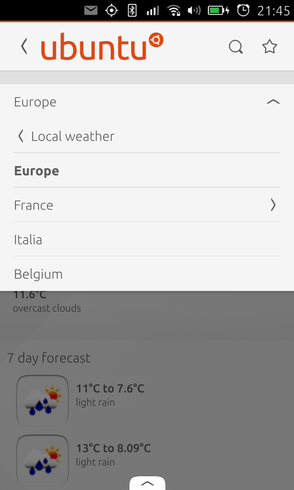
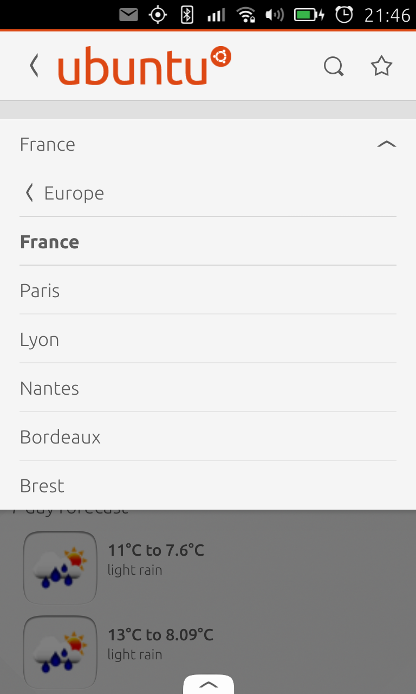

# Scopes tutorials - departments

Departments are a way for the user to navigate the data source exposed by the
scope. A Music scope can use them to allow browsing by genre, a Youtube scope
could list channels and playlists, etc. Departments can also display a full
hierarchy of sub-departments. In this tutorial, you are going to learn how to
create and add them to your scope.

This tutorial assumes you have a working scope. You can create a simple
weather scope by selecting New Project in QtCreator and pick the Unity Scope
template. This is what we are going to use in the next steps. If you need any
help for these steps, have a look at the [scope development procedures](scope-development-procedures.html) article.

## Two easy steps

Departments are registered on the reply object of your scope. This means you
can dynamically change departments between queries. To achieve that, we are
going to edit only **src/query.cpp**. You can find the source of this example
[here](http://bazaar.launchpad.net/~davidc3/ubuntu-sdk-tutorials/scope-tutorial-departments-may2015/view/head:/src/query.cpp).

### Creating departments

Let’s start by adding a new include near the top of the file:

```
#include <unity/scopes/Department.h>
```

Then, in the `try()` part of the `Query::run` method, we are going to create
our root department, this is the level 0 of our departments hierarchy.

The departments `create` function takes 3 arguments :

  * The department id (empty string for the root department)
  * The query method the department will trigger
  * The display name

Since we are working on a weather scope, let’s pick a relevant name for our
root department, remember that it will be shown by default when the user opens
the scope and should match the data you are surfacing.


```
// Create the root department with an empty string for the 'id' parameter (the first one)
sc::Department::SPtr all_depts = sc::Department::create("", query, "Local weather");
```

Then, we are going to create two other departments.

```
// Create new departments
sc::Department::SPtr paris_department = sc::Department::create("paris,fr", query, "Paris");
sc::Department::SPtr berlin_department = sc::Department::create("berlin,de", query, "Berlin");
```

As you can see, my departments ids are a bit odd: “paris,fr”, “berlin,de”.
That’s because I’m going to use them as query strings the scope will run, when
the user selects one of them.

Now, since departments are a hierarchy, we need to add these departments as
sub-departments of the root.

```
// Register them as subdepartments of the root
all_depts->set_subdepartments({paris_department, berlin_department});
```

Note that you can also use `add_subdepartmen`t if you want to add another
department to an existing list of sub-departments. Have a look at the [APIdoc](/api/scopes/sdk-14.10/unity.scopes.Department/) for the complete list of
departments methods.

The last thing needed is registering the root department on the reply object.

    // Register the root department on the reply
    reply->register_departments(all_depts);

If you try to run the scope at this point, you should see a new piece of UI at
the top of your results!





### Using departments in queries

Departments are only available in surfacing mode (when the user has not
manually entered a query). In the `try()` part of the `Query::run` method, you
can see the following lines :

```
if (query_string.empty()) {
    // If the string is empty, get the current weather for London
    current = client_.weather("London,uk");
} else {
    // otherwise, get the current weather for the search string
    current = client_.weather(query_string);
}
```

Let’s make a simple change to handle departments queries: we are going to
check if the selected `department_id` is not empty. That will mean the user
has selected a department (since the empty one is the root, selected by
default).

```
if (!query.department_id().empty()) {
    // If a department other than the root is selected, get the current weather for its id
    current = client_.weather(query.department_id());
} else if (query_string.empty()) {
    // If the search string is empty, get the current weather for London
    current = client_.weather("London,uk");
} else {
    // otherwise, get the current weather for the search string
    current = client_.weather(query_string);
}
```




## Complex hierarchies

Departments allow navigating complex hierarchies, let’s demonstrate that with
a slightly bigger example. We are going to create A
**root-&gt;continents-&gt;countries-&gt;city hierarchy**.

```
sc::Department::SPtr all_depts = sc::Department::create("", query(),
"Local weather");

sc::Department::SPtr europe_department = sc::Department::create("europe",
query(), "Europe");

sc::Department::SPtr africa_department = sc::Department::create("africa",
query(), "Africa");

sc::Department::SPtr northamerica_department =
sc::Department::create("north america", query(), "North America");

sc::Department::SPtr southamerica_department =
sc::Department::create("south america", query(), "South America");

sc::Department::SPtr asia_department = sc::Department::create("asia",
query(), "Asia");

sc::Department::SPtr australia_department =
sc::Department::create("australia", query(), "Australia");

all_depts->set_subdepartments({africa_department,

northamerica_department,

southamerica_department,

asia_department,

europe_department,

australia_department});

sc::Department::SPtr france_department = sc::Department::create("france",
query(), "France");

sc::Department::SPtr italia_department = sc::Department::create("italia",
query(), "Italia");

sc::Department::SPtr belgium_department =
sc::Department::create("belgium", query(), "Belgium");

europe_department->add_subdepartment(france_department);

europe_department->add_subdepartment(italia_department);

europe_department->add_subdepartment(belgium_department);

france_department->add_subdepartment(sc::Department::create("paris,fr",
query(), "Paris"));

france_department->add_subdepartment(sc::Department::create("lyon,fr",
query(), "Lyon"));

france_department->add_subdepartment(sc::Department::create("nantes,fr",
query(), "Nantes"));

france_department->add_subdepartment(sc::Department::create("bordeaux,fr"
, query(), "Bordeaux"));

france_department->add_subdepartment(sc::Department::create("brest,fr",
query(), "Brest"));

reply->register_departments(all_depts);
```

Lets see what it does !








### Going further

Of course, nobody wants to create a large numbers of departments by hand, you
can have a look at [this example scope](http://bazaar.launchpad.net/%7Edavidc3/ubuntu-sdk-tutorials/scope-tutorial-ifixit-departments/files) where departments are generated via a
request to an online service. If the API you are using is providing a way to
list item categories or has data that can be split in a logical way, make
sure you provide departments for the user to easily browse it!


