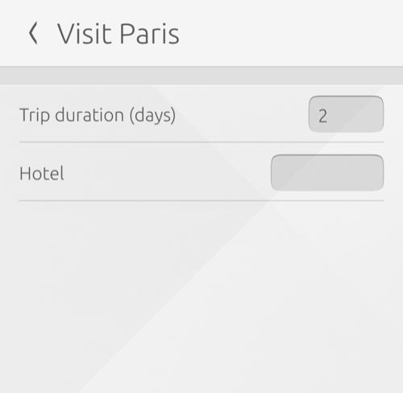
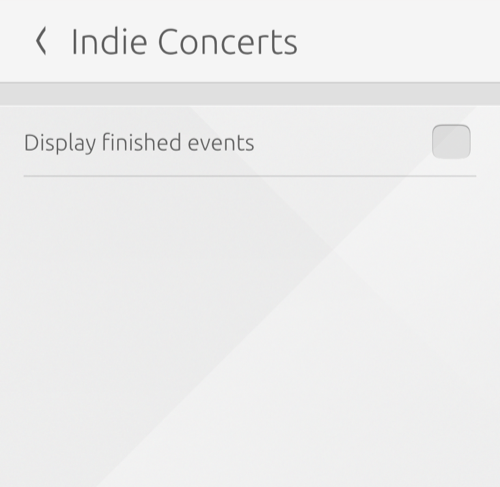
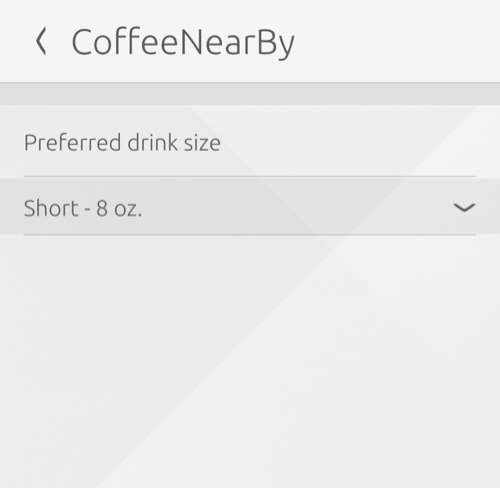
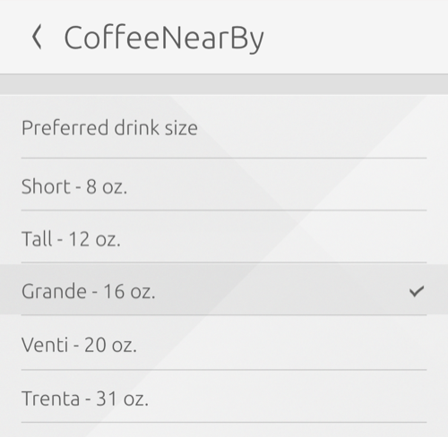
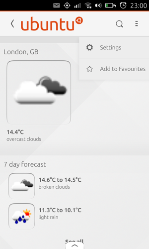
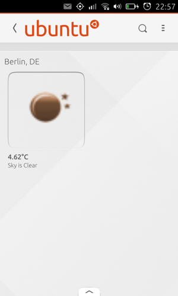

# Scopes tutorials - adding settings to your scope

A scope can provide persistent settings for simple customizations, such as
allowing the user to configure an email address or select a distance unit as
metric or imperial.

## Defining settings

You can define such settings in a configuration file. The file must be placed
into the same directory as the scope’s normal configuration file, with the
name `<scope>-settings.ini`.

For example, for a scope with ID "myscope", the normal configuration file is
`myscope.ini`, and the settings definition file is `myscope-settings.ini`. Both
files must be installed in the same directory (together with the scope’s `.so`
file).

The shell constructs a user interface from the settings definitions. The user
can change settings via that UI. The scope can then retrieve actual settings
values at run time.

### Types

The following types are supported for settings:

  * string: a string value
  * number: a numeric value (integer or floating point)
  * boolean: true or false
  * list: a list of alternatives to choose from (single-choice)

**Note**: Please see [Scope settings - what does “list” typereturns?](http://askubuntu.com/questions/548788/scope-settings-what-does-list-type-returns) from Ask Ubuntu

It is possible to optionally define a default value for each setting.

### UI Examples

#### number, string

These types provide text inputs.




#### boolean

This type provides a checkbox.




#### list

This type provides an expandable list.





## <scope>-settings.ini

The file must contain a group for each setting. The order of the groups
determines the display order for the user interface that is constructed by the
shell. The group name is the ID of the corresponding setting.

Each setting definition must contain at least the following mandatory
definitions:

  * type: Defines the type of the setting (string, number, boolean, or list).
  * displayName: Defines a display name that is shown for this setting by the shell.

The defaultValue field is optional. If present, it defines a default value
that is provided to the scope if the user has not changed anything (or has
never used the settings UI before using the scope). It is possible to test for
settings that do not have a default value and were never set by the user.

For settings of type list, the displayValues field is mandatory. It must
contain an array that lists the available choices. If you provide a default
value, it must be in the range 0..max-1 (where max is the number of choices).

The displayName and displayValues fields can be localized by appending a
locale identifier in square brackets. If no entry can be found that matches
the current locale, the non-localized value is used.

Here is an example of a `<scope>-settings.ini` file using all the settings types:

```
[location]
 type = string
 defaultValue = London
 displayName = Location

[distanceUnit]
 type = list
 defaultValue = 1
 displayName = Distance Unit
 displayName[de] = Entfernungseinheit
 displayValues = Kilometers;Miles
 displayValues[de] = Kilometer;Meilen

[age]
 type = number
 defaultValue = 23
 displayName = Age

[enabled]
 type = boolean
 defaultValue = true
 displayName = Enabled

# Setting without a default value

[color]
 type = string
 displayName = Color
```

## Accessing settings, step by step

Let’s add some settings to our default scope template and make them interact
with our results model. Create a new scope project and select the HTTP+JSON
API template. This template provides a basic weather scope that we will use
for this tutorial. You can retrieve all the files of our final scope with its
settings in [this branch](http://bazaar.launchpad.net/~davidc3/ubuntu-sdk-tutorials/scope-tutorial-settings-may2015/files).

### Edit the settings file

First, open the settings file in the `src/data` folder, and declare the
following settings:

```
[location]
 type = string
 defaultValue = London
 displayName = Location

[forecast]
 type = boolean
 defaultValue = true
 displayName = Forecast
```

The “location” setting will be used to allow the user to provide a default
search for current weather and “forecast” will allow the user to turn on and
off forecast results.

### query.h

In [src/query.h](http://bazaar.launchpad.net/~davidc3/ubuntu-sdk-tutorials/scope-tutorial-settings-may2015/view/head:/src/query.h), in the
Query class, we need to declare 3 things:

  * `initScope()`: A function that will send the current settings state each time the scope is queried
  * `s_location` and `s_forecast`: two variables to store the output of our settings.

Add the following lines at the end of the Query class, or paste the content of
[this file](http://bazaar.launchpad.net/~davidc3/ubuntu-sdk-tutorials/scope-tutorial-settings-may2015/view/head:/src/query.h) into yours.

```
private:
     void initScope();
     std::string s_location;
     bool s_forecast;
};
```

### query.cpp

#### Retrieve settings value

We are now going to create our function exposing settings value to the scope.
At the bottom of [src/query.cpp](http://bazaar.launchpad.net/~davidc3/ubuntu-sdk-tutorials/scope-tutorial-settings-may2015/view/head:/src/query.cpp), let’s add a few lines that :

  * Request settings data
  * Check if the config is empty
  * Fill our "s_" variables with the location (string) and forecast (double) settings values.

```
void Query::initScope()
{
    unity::scopes::VariantMap config = settings();
    if (config.empty())
        cerr << "CONFIG EMPTY!" << endl;
    s_location = config["location"].get_string();
    s_forecast = config["forecast"].get_bool();
}
```

#### Use settings to change the results model

We are now going to call our new function to make the data available at query
time.

Just add it at the beginning of the `Query::run` method:

```
void Query::run(sc::SearchReplyProxy const& reply) {
    try {
        initScope();
(...)
```

#### Location value

By default, this example scope does a “London” query to OpenWeatherMap when
the user doesn’t provide a query string. Let’s change that .

We want our location value to be used by default. Since our scope does two
queries (one for the current weather and one for the forecast) we need to fix
the default query in two places. Replace “London” by our s_location variable
in both client_.weather() calls that are done when the query is empty :

```
if(query_string.empty()) {
    // If the string is empty, get the current weather for the location in settings
    current = client_.weather(s_location);
 } else {
    // otherwise, get the current weather for the search string
    current = client_.weather(query_string);
 }
if (query_string.empty()) {
    // If there is no search string, get the forecast for the location in settings
    forecast = client_.forecast_daily(s_location);
} else {
    // otherwise, get the forecast for the search string
    forecast = client_.forecast_daily(query_string);
}
```

#### Forecast value

The scope also provides weather forecast for seven days. For the sake of the
example, the forecast setting is going to give the option to turn off forecast
results.

At the top of the Forecast class, let’s do a check for the state of this setting and ignore everything coming from it when s_forecast is false.

Simply add :

```
if(!s_forecast){
    return;
}
```

## That’s it!

Our scope now has working settings and should look like this:





