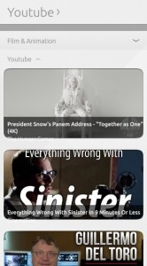
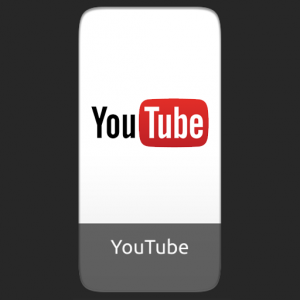

# Scopes tutorials - publishing your scope

Now that your scope is in a working state, it’s time to get it ready for
publication. In this tutorial you will learn how to make your scope look good
when the user is browsing the store or scopes installed on the device.

In the next steps, we are going to prepare a few graphics, edit the
`<scope>.ini` file located in the data directory of your project and package the
scope for the store.

## data/<scope>.ini

At the top of this file, the `ScopeConfig` section contains data that is
going to be used to display your scope when it’s not running, for example when
the user is browsing installed scopes.

```
[ScopeConfig]
 _DisplayName=YouTube
 _Description=Search YouTube for videos and browse channels
 Art=screenshot.png
 Author=Canonical Ltd.
 Icon=icon.png
```

### DisplayName

The text that will appear in the header of your scope when running (unless you
are [using a logo](../guides/scopes-customization-branding.md)),
but it’s also what users will see in the store and in their installed scopes
list. Make sure you are using a unique DisplayName to make your scope stand
out.

### Description

This text will appear when users preview your scope. It can be a simple
tagline or an explanation of the type of content this scope gives access to.
It can be different from your store description.

### Art

The image preview of your scope. This field is called Art because it’s using
the same naming metaphor scopes results use. It should be a screenshot of your
scope in action.

To take a screenshot of your scope running on a phone or in an emulator, you
can use the phablet-screenshot command line tool (`phablet-screenshot
<filename>.png`), `Shift+Ctrl+P` from QtCreator or pressing `Volume up` + `Volume
down` on the device.




### Icon

The icon used to represent your scope in the installed scopes list. A 512×512
png icon is recommended. Note that it will be cropped to match the screen size
ratio of the device and the display name will be overlayed at the bottom.

To look good when cropped, the point of focus (in this example, the YouTube
logo) you should be slightly above the horizontal center and its width should
be a third of the icon size.

 

## Creating the package

The click package is the file you will upload to the store.

To create it from QtCreator, make sure you have an armhf kit selected and go
to the Publish page. Click the “Create and validate Click package” button and
wait a few seconds for the build and validation tests to run.


If everything is green, your click package is ready to be submitted to the
store! It’s in your build folder (“`build-<kit name>-<project name>`”, located
in the same folder as your project folder is).

## Publishing

That’s it, you can go to the store page, and upload your scope. It will be
available to users in minutes! For guidance on the publication process itself,
have a look at the [Publish](/en/publish/) section.
