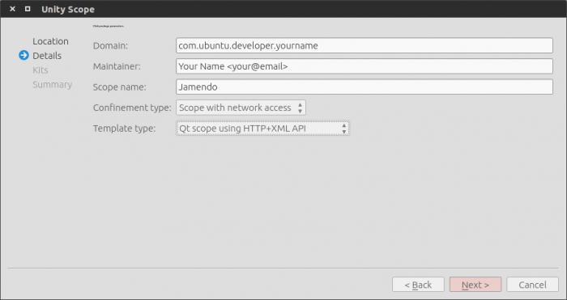
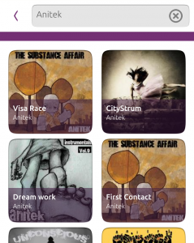
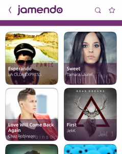
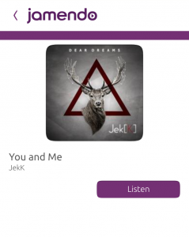

# Write a scope in C++ for XML data

## Jamendo tutorial

In this tutorial, you will learn how to write a scope in C++ for Jamendo,
using the Ubuntu SDK. For this example, very limited C++ knowledge is actually
required and adapting it to another service exposing a XML API will be fairly
simple.

**Note:** This tutorial should work for Ubuntu 14.04 and later versions. If you are using 14.04, you will need [an emulator or a device](/apps/sdk/tutorials/running-apps-from-the-sdk/). If you want to use the desktop scopes layout tool, you will need at least Ubuntu 14.10.

## SDK setup

The SDK provides various templates for different types of applications. C++
scopes have their own template, and this is what we are going to use. Hit the
“New Project” button to create a new scope project. You will be asked to fill
a few values to generate it.

In the third screen of the wizard, we are going to pick the “Qt scope using
HTTP + XML API” template.

If you need more help to get started with the SDK, have a look at the [SDKsetup article](/apps/sdk/tutorials/creating-an-sdk-app-project/).

**Note:** Even if you are used to the [security policies](/en/publish/security-policy-groups/) of the platform, there is one more thing you need to know with scopes : if you need to use the network at some point, you won’t be able to access user data. This is a logical privacy policy to avoid user data extraction without explicit consent.

## Testing your scope

At any point during this tutorial, you can press the Play button on the
sidebar of the SDK to test the scope on [your phone or on in anemulator](/apps/sdk/tutorials/running-apps-from-the-sdk/). Wait a few seconds
for your project to be built and uploaded to the device, it should then open
by itself.

## Key source files

You can get the source code of this tutorial by running

$ bzr branch lp:~davidc3/ubuntu-sdk-tutorials/scope-tutorial-jamendo-qtxml

The generated project contains quite a lot of files and we are going to talk
about the most important ones. One thing to note is that the template already
provides a working scope : a weather scope using openweathermap.org. We are
going to change it to pull results from Jamendo.

### manifest.xml

Its content will be used by the build system to generate a click package,
which you will be able to install and publish on the Ubuntu Store. In most
cases you can keep default values that have been pulled from your developer
environment.

### <scope>.apparmor

Security policy groups used by your scopes. None in our case, since the
“ubuntu-scope-network” template we are using already allows network calls.
Learn more about [security policy groups](/en/publish/security-policy-groups/).

### data/<appid>.ini

[Link to the file](http://bazaar.launchpad.net/%7Edavidc3/ubuntu-sdk-tutorials/scope-tutorial-jamendo-qtxml/view/head:/data/com.ubuntu.developer.davidcalle.jamendo-scope_jamendo.ini)

A very important file that will allow you to customize and brand your scope
(icon, background images, colors…). We will see that in a moment.

### include/api/config.h

[Link to the file](http://bazaar.launchpad.net/%7Edavidc3/ubuntu-sdk-tutorials/scope-tutorial-jamendo-qtxml/view/head:/include/api/config.h)

Our HTTP config: user agent and base API URL. Let’s make our first change by
changing the apiroot to the Jamendo API URL.

15

`std::string apiroot {
``"[https://api.jamendo.com/v3.0](https://api.jamendo.com/v3.0)"` `};`

Other URL parameters will be added later with the net-cpp library.

### include/api/client.h, /scope/scope.h, /scope/query.h, /scope/preview.h

[Link to the folder](http://bazaar.launchpad.net/%7Edavidc3/ubuntu-sdk-tutorials/scope-tutorial-jamendo-qtxml/files/head:/include/)

The rest of our C++ headers. As seen below, change the
[client.h](http://bazaar.launchpad.net/%7Edavidc3/ubuntu-sdk-tutorials/scope-tutorial-jamendo-qtxml/view/head:/include/api/client.h) header to match the
data structure of the Jamendo API. You can leave the rest of headers as they
are.

This is how my Client class now looks like. You can try it by pasting the
content of the tutorial file into your own :

22

23

24

25

26

27

28

29

30

31

32

33

34

35

36

37

38

39

40

41

42

43

44

45

46

47

48

49

50

51

52

53

54

55

56

57

58

59

60

61

62

63

64

65

66

67

68

69

70

71

72

73

74

75

76

77

78

79

80

81

82

83

`class` `Client {`

` ``public``:`

` ``/**`

` ``* Track info.`

` ``*/`

` ``struct` `Track {`

` ``std::string title;`

` ``std::string uri;`

` ``std::string art;`

` ``std::string artist;`

` ``};`

` ``/**`

` ``* A list of Track objects.`

` ``*/`

` ``typedef` `std::deque<Track> TrackList;`

` ``/**`

` ``* Track results.`

` ``*/`

` ``struct` `TrackRes {`

` ``TrackList tracks;`

` ``};`

` ``Client(Config::Ptr config);`

` ``virtual` `~Client() = ``default``;`

` ``/**`

` ``* Get the track list for a query`

` ``*/`

` ``virtual` `TrackRes tracks(``const` `std::string &query);`

` ``/**`

` ``* Cancel any pending queries`

` ``* (this method can be called from a different thread)`

` ``*/`

` ``virtual` `void` `cancel();`

` ``virtual` `Config::Ptr config();`

`protected``:`

` ``void` `get(``const` `core::net::Uri::Path &path,`

` ``const` `core::net::Uri::QueryParameters &parameters,`

` ``QXmlStreamReader &reader);`

` ``/**`

` ``* Progress callback that allows the query to cancel pending HTTP
requests.`

` ``*/`

` ``core::net::http::Request::Progress::Next progress_report(`

` ``const` `core::net::http::Request::Progress& progress);`

` ``/**`

` ``* Hang onto the configuration information`

` ``*/`

` ``Config::Ptr config_;`

` ``/**`

` ``* Thread-safe cancelled flag`

` ``*/`

` ``std::atomic<``bool``> cancelled_;`

`};`

### src/api/client.cpp

[Link to the file](http://bazaar.launchpad.net/%7Edavidc3/ubuntu-sdk-tutorials/scope-tutorial-jamendo-qtxml/view/head:/src/api/client.cpp)

Our API client. It provides separation between the scope code and the HTTP API
access. Its sole purpose is to retrieve data from Jamendo.

### src/scope/scope.cpp

[Link to the file](http://bazaar.launchpad.net/%7Edavidc3/ubuntu-sdk-tutorials/scope-tutorial-jamendo-qtxml/view/head:/src/scope/scope.cpp)

This file defines a class of type
[unity::scopes::ScopeBase](/api/scopes/sdk-14.10/unity.scopes.ScopeBase/) that
provides the entry point API the client uses to interact with the scope.

  * It implements start and stop methods. Many scopes can leave these unmodified, and this example does as well.
  * It also implements two key methods: search and preview. These methods often do not need to be modified and they are not modified in this example. However, they call critical methods that do need to be implemented in every scope, as discussed below.

**Note**: You may find it useful to check out the ScopeBase class declaration (its API) in the corresponding header file: include/scope/scope.h. The header file is a great way to understand C++ classes because their API is declared without any additional implementation code, making it easy to understand.

**Tip**: Check out the [Unity 8 Scope API reference docs](/api/scopes/sdk-14.10/) during this tutorial if you want a deeper understanding of specific classes.

### src/scope/query.cpp

[Link to the file](http://bazaar.launchpad.net/%7Edavidc3/ubuntu-sdk-tutorials/scope-tutorial-jamendo-qtxml/view/head:/src/scope/query.cpp)

Here is where we send queries to the API client, transform returned results
into result cards, declare categories that will host these cards and their
layout.

This file defines a class of type [unity::scopes::SearchQueryBase](/api/scopes/sdk-14.10/unity.scopes.SearchQueryBase/).

This class generates search results from a query string a client provides and
returns them as a reply to the client:

  * Receives the query string from the client
  * Receives a reply object from the client
  * Sends the query to the API client
  * Creates search result categories (for example with different layouts : grid/carousel)
  * Combines each search result with its category (creating CategorisedResult objects)
  * Pushes categorised results into the reply object for display by the client

Much of the coding work is done in the run method, and our changes here will
be minimal.

Check out the SearchQueryBase class declaration (its API) in the corresponding
header file: include/scope/query.h.

### src/scope/preview.cpp

[Link to the file](http://bazaar.launchpad.net/%7Edavidc3/ubuntu-sdk-tutorials/scope-tutorial-jamendo-qtxml/view/head:/src/scope/preview.cpp)

This key file defines a class of type [unity::scopes::PreviewQueryBase](/api/scopes/sdk-14.10/unity.scopes.PreviewQueryBase/).

This class defines the widgets and layouts used for each search result during
the preview phase. It:

  * Defines the widgets used in previews
  * Maps widget fields to data fields in each result
  * Defines layouts with different numbers of columns – known only by the client at display time, depending on the display size.
  * Assigns widgets to columns for each layout
  * Receives a reply object and pushes the widgets and layouts onto it for use by the client

Check out the SearchPreviewBase class declaration (its API) in the
corresponding header file: include/scope/preview.h.

For a list of Preview Widgets and documentation, see [thispage](/api/scopes/sdk-14.10/preview_20widget_20types).

Let’s drill into our example scope and detail some of the code, starting with
the query.

## Query string

In [src/scope/query.cpp](http://bazaar.launchpad.net/%7Edavidc3/ubuntu-sdk-tutorials/scope-tutorial-jamendo-qtxml/view/head:/src/scope/query.cpp), you
can easily see where the scope is receiving the user query. When the scope is
opened, this query is blank and you will want to provide some data for this
case. It’s a good opportunity to surface featured content or latest/popular
items.

Here, I’m triggering a search for an empty string by default. In this case,
the Jamendo API is returning the most popular songs of the week, which is a
reasonably good default set of results to present to users. Modify the
[Query::run method](http://bazaar.launchpad.net/%7Edavidc3/ubuntu-sdk-tutorials/scope-tutorial-jamendo-qtxml/view/head:/src/scope/query.cpp#L50) so
that it looks like this, or simply paste the content of the tutorial file into
your own :

52

53

54

55

56

57

58

59

60

61

62

63

64

`void` `Query::run(sc::SearchReplyProxy ``const``& reply) {`

` ``try` `{`

` ``// Start by getting information about the query`

` ``const` `sc::CannedQuery &query(sc::SearchQueryBase::query());`

` ``// Trim the query string of whitespace`

` ``string query_string = alg::trim_copy(query.query_string());`

` ``Client::TrackRes trackslist;`

` ``// Use the query string to get a list of tracks`

` ``trackslist = client_.tracks(query_string);`

`(...)`

## Generating search results

Let’s move on to
[api/client.cpp](http://bazaar.launchpad.net/%7Edavidc3/ubuntu-sdk-tutorials/scope-tutorial-jamendo-qtxml/view/head:/src/api/client.cpp) to get
some results from Jamendo…

net-cpp is the simple networking library we are going to use to query the API.
You can, however, replace it and use any other networking library to suit your
purposes. The template already provides a get method using net-cpp to handle
HTTP headers and errors, parse the response and return an XML document. Try it
by simply pasting the content of the tutorial file into your own.

The base URI is pulled from our config header, we just need to add the rest of
our path and parameters :

97

98

99

100

`get({``"tracks"``},`

` ``{{``"client_id"``, ``"b6747d04"``}, {``"format"``, ``"xml"``},`

` ``{``"order"``, ``"popularity_week"``}, {``"search"``, query}},`

` ``root);`

Our query URI will look like:

[https://api.jamendo.com/v3.0/tracks/?client_id=b6747d04&format=xml&order=popularity_week&search=<query>](https://api.jamendo.com/v3.0/tracks/?client_id=b6747d04&format=xml&order=popularity_week&search=)

**Note about client_id:** if you wish to distribute a Jamendo scope, you will need to register your own API key at [Jamendo Developers](https://developers.jamendo.com/) (it’s free and takes 5 minutes). In the above sample, I’m using their example key.

Then, we need to iterate over each result present in our root XML object and
extract what we need:

90

91

92

93

94

95

96

97

98

99

100

101

102

103

104

105

106

107

108

109

110

111

112

113

114

115

116

117

118

119

120

121

122

123

124

125

`Client::TrackRes Client::tracks(``const` `string& query) {`

` ``QXmlStreamReader root;`

` ``TrackRes result;`

` ``// Build a URI and get the contents.`

` ``// The fist parameter forms the path part of the URI.`

` ``// The second parameter forms the CGI parameters.`

` ``get({``"tracks"``},`

` ``{{``"client_id"``, ``"b6747d04"``}, {``"format"``, ``"xml"``},`

` ``{``"order"``, ``"popularity_week"``}, {``"search"``, query}},`

` ``root);`

` ``while` `(!root.atEnd() && !root.hasError()) {`

` ``QXmlStreamReader::TokenType token = root.readNext();`

` ``/* If token is just StartDocument, we'll go to next.*/`

` ``if` `(token == QXmlStreamReader::StartDocument) {`

` ``continue``;`

` ``}`

` ``/* If token is StartElement, we'll see if we can read it.*/`

` ``if` `(token == QXmlStreamReader::StartElement) {`

` ``if` `(root.name() == ``"track"``) {`

` ``parseTrack(result, root);`

` ``} ``else` `{`

` ``root.readNext();`

` ``}`

` ``}`

` ``}`

` ``if` `(root.hasError()) {`

` ``throw` `domain_error(root.errorString().toStdString());`

` ``}`

` ``return` `result;`

`}`

The parseTrack() method is using QXml to iterate over “track” XML nodes in our
data. We look for the title, artist, art and url, we use them to populate an
array of Track objects.

28

29

30

31

32

33

34

35

36

37

38

39

40

41

42

43

44

45

46

47

48

49

50

51

52

`static` `void` `parseTrack(Client::TrackRes& result, QXmlStreamReader& xml)`

`{`

` ``// Create a track object`

` ``Client::Track track;`

` ``while` `(!xml.atEnd() && !(xml.isEndElement() && xml.name() ==
``"track"``))`

` ``{`

` ``if` `(xml.isStartElement()) {`

` ``if` `(xml.name() == ``"name"``) {`

` ``track.title = readText(xml).toStdString();`

` ``}`

` ``if` `(xml.name() == ``"artist_name"``) {`

` ``track.artist = readText(xml).toStdString();`

` ``}`

` ``if` `(xml.name() == ``"shareurl"``) {`

` ``track.uri = readText(xml).toStdString();`

` ``}`

` ``if` `(xml.name() == ``"album_image"``) {`

` ``track.art = readText(xml).toStdString();`

` ``}`

` ``}`

` ``xml.readNext();`

` ``}`

` ``// Add the track to our list of results`

` ``result.tracks.emplace_back(track);`

`}`

You can, of course, use any mean you want to extract this data, like XPath and
other libraries like LibXML. The point is to create a list of structured
result objects that we are answering back to query.cpp.

That’s it for parsing! We have the data we need and are going to see how to
display it the way we want.

## Category renderers

Each result needs to be displayed inside a category. In terms of UI, a
category can provide a header title to a list of results and a specific layout
for both the way results are positioned and the way they look. Try it by
pasting the content of the tutorial file into your own, or follow these steps.

CategoryRenderers are created from JSON objects. These are created as raw
strings. The JSON objects have two fields of immediate interest: template and
components.

Modify the categories on
[src/scope/query.cpp](http://bazaar.launchpad.net/%7Edavidc3/ubuntu-sdk-tutorials/scope-tutorial-jamendo-qtxml/view/head:/src/scope/query.cpp) to
resemble this:

22

23

24

25

26

27

28

29

30

31

32

33

34

35

36

37

38

39

40

41

`const` `static` `string TRACKS_TEMPLATE =`

` ``R"(`

` ``{`

` ``"schema-version"``: 1,`

` ``"template"``: {`

` ``"category-layout"``: ``"grid"``,`

` ``"card-layout"``: ``"vertical"``,`

` ``"card-size"``: ``"medium"``,`

` ``"overlay"``: ``true`

` ``},`

` ``"components"``: {`

` ``"title"``: ``"title"``,`

` ``"subtitle"``: ``"artist"``,`

` ``"art"` `: {`

` ``"field"``: ``"art"`

` ``},`

` ``"overlay-color"` `: ``"overlay"`

` ``}`

` ``}`

` ``)";`

This will display a simple list of results, it’s a category style used in many
scopes, working well with many types of content. You can have a look at all
your options in the [unity::scopes::CategoryRendererdoc](/api/scopes/sdk-14.10/unity.scopes.CategoryRenderer/).

Now, in the try{} part of the Query::run method, we can register our category
on the reply object :

68

69

70

71

72

`auto tracks_cat = reply->register_category(``"tracks"``, ``""``, ``""``,`

` ``sc::CategoryRenderer(TRACKS_TEMPLATE));`

`// register_category(arbitrary category id, header title, header icon,
template)`

`// In this case, since this is the only category used by our scope,`

`// it doesn’t need to display a header title, we leave it as a blank string.`

## Results

For this Jamendo scope to be useful, we want each result to have at least:

  * a URI : the link to the track page (required)
  * a category : as seen above, it determines where and how the result is displayed in the UI (required)
  * a title : the name of the track
  * an artist : the name of the band/artist
  * a visual : the album/track cover
  * an “overlay” color (#aarrggbb), we are going to use to give a purple tint to our overlay template component.

Make sure every fields you have defined in your category template components
are presents in results, even if they are empty. Invalid results will be
automatically discarded.

Still in [src/scope/query.cpp](http://bazaar.launchpad.net/%7Edavidc3/ubuntu-sdk-tutorials/scope-tutorial-jamendo-qtxml/view/head:/src/scope/query.cpp), in
the try{} part of our Query::run method, we need to iterate over our tracks
list, and create a [unity::scope::CategorisedResult](/api/scopes/sdk-14.10/unity.scopes.CategorisedResult/) for each. Paste the content of the tutorial file
into your own, or reproduce the following lines :

72

73

74

75

76

77

78

79

80

81

82

83

84

85

86

87

88

89

90

91

92

93

94

`for` `(``const` `auto &track : trackslist.tracks) {`

` ``// Iterate over the trackslist`

` ``sc::CategorisedResult res(tracks_cat);`

` ``// We must have a URI`

` ``res.set_uri(track.uri);`

` ``// We also need the track title`

` ``res.set_title(track.title);`

` ``// Set the rest of the attributes, art, artist, etc`

` ``res.set_art(track.art);`

` ``res[``"artist"``] = track.artist;`

` ``res[``"overlay"``] = ``"#88743074"``;`

` ``// Push the result`

` ``if` `(!reply->push(res)) {`

` ``// If we fail to push, it means the query has been cancelled.`

` ``// So don't continue;`

` ``return``;`

` ``}`

`}`

As you can see, you can use specific methods for some fields (set_art,
set_uri…) and can also add custom fields (artist, stream, duration…).

## Previews

The preview needs to generate widgets and connect their fields to the data
fields in the CategorisedResult.

It also should generate layouts to handle different display environments. The
idea is that only the client knows the layout context. The client thinks of
the display context it in terms of the number columns available. The scope
defines which columns to put widgets into for layouts with different numbers
of columns.

First, let’s take a look at widgets.

### Preview Widgets

There is a set of predefined Preview Widgets. Each has a type field you use to
create them. Each type of widget also has additional fields that vary by
widget type.

You can see the the list of Preview Widget types and the fields they offer
[here](/api/scopes/sdk-14.10/previewwidgets/).

This example uses three types of Preview Widgets:

  * header: has a title and a subtitle field
  * image: has a source field used to retrieve the art from
  * actions: used to provide button text “Listen” and the URI opened when the user clicks the preview

Here’s how our example creates a header widget named w_header on the
Preview::run method of
[src/scope/preview.cpp](http://bazaar.launchpad.net/%7Edavidc3/ubuntu-sdk-tutorials/scope-tutorial-jamendo-qtxml/view/head:/src/scope/preview.cpp):

40

`sc::PreviewWidget w_header(``"headerId"``, ``"header"``);`

  * The first parameter is an arbitrary ID. We use these IDs to assign the widget to different layouts, as shown later.
  * The second parameter is the Preview Widget type, one of the set of pre-defined types.

After widget creation, the widget fields are populated with data from the
CategorisedResult being processed by the client. Our w_header widget’s
standard fields: title and subtitle are populated.

Two methods are available to put data into widget fields:

  * add_attribute_value(FIELD, VALUE): You can use this method to simply populate data you have on hand into the widget field
  * add_attribute_mapping(FIELD, CR_FIELD): Use this method to populate data from the CategorisedResult being processed into the widget field.

In our example, widget data is derived from the current CategorisedResult, and
so add_attribute_mapping is used.

First, let’s map the w_header widget’s title field (the first parameter) to
the title field in the current CategorisedResult (the second parameter):

42

`w_header.add_attribute_mapping(``"title"``, ``"title"``);`

The next example is a little more interesting because we populate a widget
field from a CategorisedResult field that is not part of the CategoryRenderer.
The field is artist. We added the artist key and value directly to our
CategorisedResult for each result previously. So this example shows how to
display data in your preview even when the data is not displayed in results
phase and is custom to the scope:

43

`w_header.add_attribute_mapping(``"subtitle"``, ``"artist"``);`

Looking back at the query, where the CategorisedResults were created, we see
again how the artist data was made available to the CategorisedResult:

84

`res[``"artist"``] = track.artist.username;`

As a result of that, each CategorisedResult has an “artist” field populated
from the search result. And in this preview phase, we push that artist data
into the w_header widget’s predefined subtitle field.

The content of the tutorial file can be pasted into your own to try these
widgets.

Here is the result of our changes :

39

40

41

42

43

44

45

46

47

48

49

50

51

52

53

54

55

56

57

58

59

60

61

62

`// Define the header section`

`sc::PreviewWidget w_header(``"headerId"``, ``"header"``);`

`// It has title and a subtitle properties`

`w_header.add_attribute_mapping(``"title"``, ``"title"``);`

`w_header.add_attribute_mapping(``"subtitle"``, ``"artist"``);`

`// Define the image section`

`sc::PreviewWidget w_art(``"imageId"``, ``"image"``);`

`// It has a single source property, mapped to the result's art property`

`w_art.add_attribute_mapping(``"source"``, ``"art"``);`

`// Define the actions section`

`sc::PreviewWidget w_actions(``"actionsId"``, ``"actions"``);`

`// Actions are built using tuples with an id, a label and a URI`

`sc::VariantBuilder builder;`

`builder.add_tuple({`

` ``{``"id"``, sc::Variant(``"open"``)},`

` ``{``"label"``, sc::Variant(``"Listen"``)},`

` ``{``"uri"``, result[``"uri"``]}`

`});`

`w_actions.add_attribute_value(``"actions"``, builder.end());`

And now they can be pushed to the client with the reply object:

61

`reply->push( { w_art, w_header, w_actions });`

The widgets are created, populated, and pushed. But, the client also needs to
know where to put the widgets, and even how to arrange the widgets nicely in
different contexts, for example a narrow screen and a wide screen, so let’s
take a look at layouts.

### Generating Layouts

Our example defines two layouts: one with a single column and one with two.
These are declared like this:

27

`sc::ColumnLayout layout1col(1), layout2col(2);`

**Tip**: Check out ColumnLayout docs [here](/api/scopes/sdk-14.10/unity.scopes.ColumnLayout/).

We do not need to know exactly how the client uses these. But the general
expectation is that a single-column layout is appropriate for narrow-screen
situations (like portrait mode) and a two-column layout may be appropriate for
wide screen situations (like landscape mode).

Now, as you can see in the tutorial file
[src/scope/preview.cpp](http://bazaar.launchpad.net/%7Edavidc3/ubuntu-sdk-tutorials/scope-tutorial-jamendo-qtxml/view/head:/src/scope/preview.cpp), we
need to define where our three widgets are going to go in each of these
layouts.

Naturally, in a single-column layout, all widgets have to go into that single
column:

30

`layout1col.add_column( { ``"imageId"``, ``"headerId"``, ``"actionsId"``});`

In the two-column layout, we decide to add the image to the first column, the
header and actions to the second column:

33

34

`layout2col.add_column( { ``"imageId"` `});`

`layout2col.add_column( { ``"headerId"``, ``"actionsId"` `});`

Now, we need to register the layouts into the reply object, as follows:

37

`reply->register_layout({layout1col, layout2col});`

## Customization and branding

By default, your scope looks like this :

Many display options can be changed in **data/<appid>.ini**. Here is my best
effort at branding this scope, most of the options are self-explicit :

1

2

3

4

5

6

7

8

9

10

11

12

13

14

`[ScopeConfig]`

`DisplayName = Jamendo`

`Description = This is a Jamendo scope doing Jamendo things`

`Art = screenshot.png`

`Author = Firstname Lastname`

`Icon = icon.png`

`[Appearance]`

`PageHeader.Logo = logo.png`

`BackgroundColor = #FFFFFF`

`PageHeader.DividerColor = #743074`

`PageHeader.ForegroundColor = #743074`

`PageHeader.Background = color:///#FFFFFF`

`PreviewButtonColor = #743074`

I’ve also found [this Jamendologo](http://bazaar.launchpad.net/%7Edavidc3/ubuntu-sdk-tutorials/scope-tutorial-jamendo-qtxml/download/head:/logo.png-20141029215821-bxtkva2thyxj5et9-16/logo.png) to
replace the one provided by the template. Download it and save it as
**data/logo.png**.

If you tweak the category layout and colors, you can get very different
styles. The one on the left is the result of using the above snippet :

Have a look at all the available [customisationoptions](../guides/scopes-customization-branding.md) and try to
make your scope shine!

**That’s it, our Jamendo scope is finished. You can launch it by pressing the Start button in the SDK sidebar, see if everything compiles and starts correctly at the bottom of the editor, and try your new scope!**

## Summary

  * We have seen how to make a scope that queries a web API
  * Query results are put into one category with a unique renderer
  * The client displays search results
  * For the preview phase, four predefined widget types were used
  * Multiple layouts were created in which widgets were allocated differently to look good on several form factors
  * Some custom data appropriate only for this scope (ex. artist) is displayed in the preview and in results

### Going further

Scopes are powerful tools to help the user accessing information and selected
content. Ubuntu provides a lot of scopes by default, but there is always room
for more !

My favorite source of fresh APIs (for books, movies, etc.) to turn into scopes
is the [ProgrammableWeb](http://www.programmableweb.com/apis/directory) API
directory, but there are many others sources. Feel free to experiment with
different layouts and cards to accommodate different types of data !

**Publishing a scope is exactly like publishing other apps, have a look at [our publishing guides](/publish/) to get your scope on the store in minutes.**

